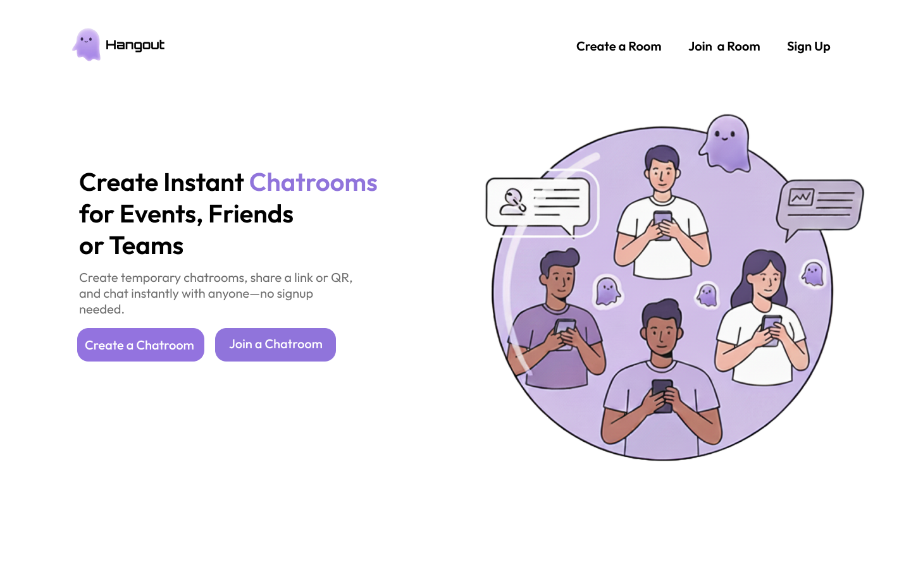

# Hangout — Real-Time Chatroom (MERN Stack)

**Hangout** is a full-stack **MERN** real-time chat application where users can create **host-controlled chat rooms** with participant limits, timed sessions, and image uploads — all powered by **Socket.IO**.

Users can join rooms via **email invitation**, **shared link**, or **meeting code**, and chat or share images securely in real time.  
Built with **simplicity**, **speed**, and **interactivity** in mind — enhanced with **Framer Motion animations** for a dynamic feel.

---

## Features

- **Host-controlled private rooms** — define participant limits and timed sessions  
- **Real-time messaging & image sharing** (Socket.IO + Cloudinary)  
- **Easy joining options** — email invitation, direct link, or meeting code  
- **Authentication & Security** — JWT-based auth, email verification, OTP-based password reset  
- **Email invitations** using Nodemailer + Brevo  
- **Animated UI** with Framer Motion  
- **Deployed** with Vercel (frontend) & Render (backend)

---

## Tech Stack

### Frontend
- React  
- Tailwind CSS  
- Framer Motion  
- React Router DOM  
- React Toastify  

### Backend
- Node.js + Express.js  
- MongoDB Atlas  
- Socket.IO  
- Cloudinary  
- Nodemailer + Brevo  
- JWT Authentication  

---

##  Folder Structure

###  Environment Variables

Create a .env file in the server directory and include the following:

MONGODB_URI=your_mongodb_connection_string
JWT_SECRET=your_jwt_secret_key
NODE_ENV=development
SMTP_USER=your_smtp_username
SMTP_PASS=your_smtp_password
SENDER_EMAIL=your_sender_email
FRONTEND_URL=http://localhost:5173
//cloudinary configs
CLOUDINARY_CLOUD_NAME=your_cloudinary_cloud_name
CLOUDINARY_API_KEY=your_cloudinary_api_key
CLOUDINARY_API_SECRET=your_cloudinary_api_secret

- When you deploy your application, you should replace these placeholders with actual, secure values and ensure these sensitive variables are configured as secrets in your hosting environment (e.g., Vercel, Heroku, AWS). Never commit your actual secrets to a public or private repository.

## Getting Started

1️⃣ Clone the repository
git clone https://github.com/yourusername/hangout-realtime-chatroom.git

2️⃣ Install dependencies

**Frontend:**
cd client
npm install

**Backend:**
cd server
npm install

3️⃣ Run the app locally

**Start the backend:**
npm run dev

**Start the frontend:**
npm run dev

## About the Project

This project was built as part of my journey to learn full-stack web development using the MERN stack.
I’m still a beginner, and this project helped me understand how real-time communication, authentication, and full-stack deployment come together.

## Feedback

I'm always open to feedback, suggestions, or collaborations!
Feel free to connect with me on [LinkedIn](www.linkedin.com/in/nishmika-eka)
 or open an issue on this repo. 
